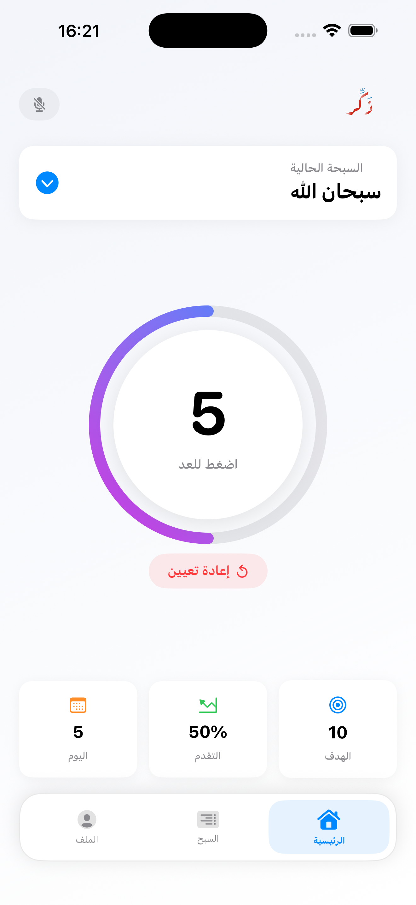
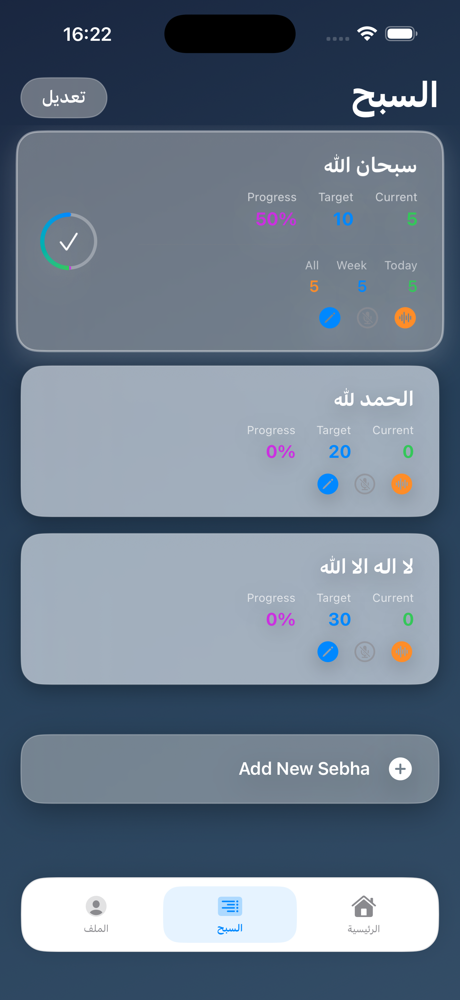
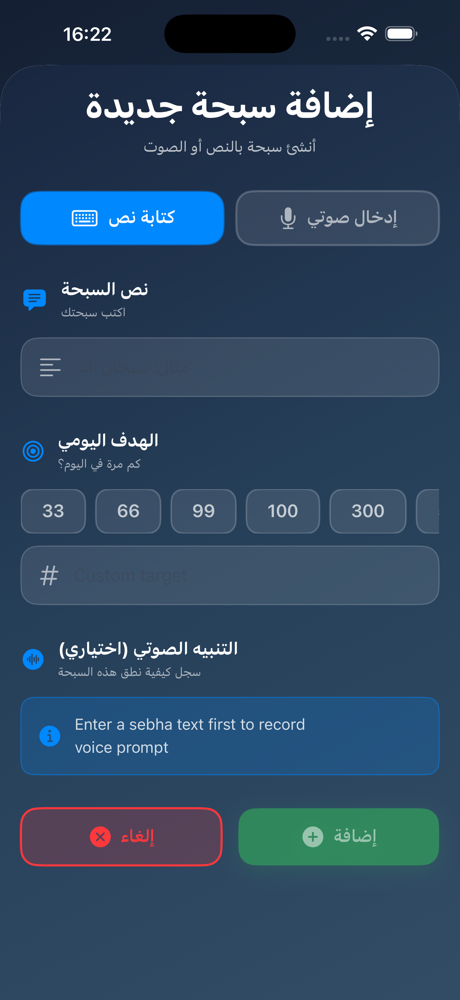

# Thakir

A modern, voice-enabled iOS app for tracking dhikr (remembrance) with intelligent Arabic speech recognition.

---

## 📱 Overview

**Thakir** is a lightweight digital sebha (prayer beads) counter built with SwiftUI. It combines traditional dhikr counting with modern features like voice recognition, custom audio prompts, and comprehensive statistics tracking.

### ✨ Key Features

- 🎙️ **Arabic Voice Recognition** — Hands-free counting with intelligent speech matching
- 🔊 **Custom Audio Prompts** — Record personalized audio for each dhikr
- 📊 **Daily Statistics** — Track your progress with daily and all-time counters
- 🎨 **Beautiful UI** — Modern SwiftUI interface with smooth animations
- 🔄 **Reorderable Lists** — Organize your dhikr collection your way
- 🌙 **Smart Normalization** — Robust Arabic text matching (handles diacritics, Alifs, invisible characters)

---

## 🚀 Quick Start

### Prerequisites

- Xcode 15 or later
- iOS 15+ device or simulator
- Microphone permission (for voice features)

### Installation

1. **Clone the repository**

   ```bash
   git clone https://github.com/yourusername/thakir.git
   cd Thakir
   ```

2. **Open in Xcode**

   ```bash
   open Thakir.xcodeproj
   ```

3. **Build & Run**
   - Select your target device or simulator
   - Press `⌘R` to build and run
   - Grant microphone permission when prompted

---

## 🎯 Key Features Explained

### Voice Recognition

The app uses advanced Arabic speech recognition with normalization to handle:

- Diacritics (تَشْكِيل)
- Different Alif forms (أ، إ، آ → ا)
- Invisible Unicode characters
- Natural speech variations

See `String.normalizedArabic()` in `Utils/Extensions.swift` for implementation details.

### Audio Recordings

- Per-dhikr audio prompts stored in app Documents directory
- Filenames persisted in UserDefaults for efficient loading
- Record, play, and delete functionality built-in

### Statistics Tracking

- Daily counters with automatic reset at midnight
- All-time totals preserved
- Per-dhikr and global statistics
- Export capabilities for data analysis

---

## 🧪 Testing

### Run Unit Tests

```bash
xcodebuild test -scheme Thakir -destination 'platform=iOS Simulator,name=iPhone 15'
```

### Run UI Tests

```bash
xcodebuild test -scheme Thakir -destination 'platform=iOS Simulator,name=iPhone 15' -only-testing:ThakirUITests
```

---

## 📸 Screenshots

<div align="center">
  
  
  
</div>

<p align="center">
  <em>Dhikr List Management • Home Counter Interface • Profile & Statistics</em>
</p>

---

## 🛠️ Development Notes

### Audio File Management

- Recordings saved by filename in UserDefaults
- Files reconstructed at runtime from Documents directory
- **Important:** Verify file existence after app updates or reinstalls

### Arabic Text Normalization

- Critical for reliable speech matching
- Handles edge cases in Arabic orthography
- Extensible for additional normalization rules

### Reordering & Persistence

- Reordering updates indices automatically
- Current selection persisted to maintain consistency
- Prevents mismatches between UI order and voice mappings

### Debug Mode

- Voice recognition includes debug logs
- Gate behind `DEBUG` flag before production release
- Use for troubleshooting speech matching issues

---

## 🤝 Contributing

Contributions are welcome! Please follow these guidelines:

1. **Fork** the repository
2. Create a **feature branch** (`git checkout -b feature/amazing-feature`)
3. **Commit** your changes (`git commit -m 'Add amazing feature'`)
4. **Push** to the branch (`git push origin feature/amazing-feature`)
5. Open a **Pull Request**

### Code Guidelines

- Keep changes scoped and focused
- Include unit tests for new features
- Follow existing code style and patterns
- Update documentation as needed

---

## 📄 License

This project is licensed under the MIT License - see the [LICENSE](LICENSE) file for details.

---

## 👤 Author

**Kareem Rashed**

- GitHub: [@Kareem-Rashed]
- Email: kareemrashed@aucegypt.edu

---

## 🙏 Acknowledgments

Built with ❤️ to help make dhikr practice easier and more accessible for everyone.
